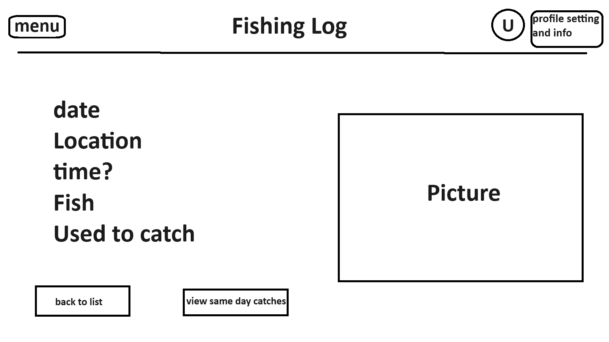

## 1. Problem Statement
Fishing Log is database of where you caught fish and what you used to catch them so that you never lose your 
fishing log in the river. Includes the ability to log what the fish was, what river it was on, and what fly 
(or bait) you used to catch them. You can add, edit and delete logs. Extensions would be to have it recommend 
something to fish with on that river based on the time of year and how most fish were caught during that time of year. 
Further extension would be adding exact coordinates on the river of where the fish was caught.


## 2. Use Cases

Fishing Log User Stories

As a user I want to be able to create an account and log in so that my data can be accessed by only me.

As a user I want to be able to create a log of a catch so I can keep track of my catches.

As a user I want to be able to delete a lof of a catch in case I no longer need it.

As a user I want to be able to edit a log of a catch in case I over embelished the size of the fish.

As a user I want to be able to see a list of all of my catches so I can view them all at the same time.

As a user I want to be able to sort my catches by size, location, ect.. so that I can view them more comprehensively

As a user I want to be able to search for a specific catch so I can find the catch I'm looking for.

As a user I want to be able to look at the specifics of a catch so I can get all the information.

As a user I want to be able to look at catches that are between a specific time frame.

As a user I want to be able to upload a photo of the fish I caught to remember the day.

As a user I want to be able to delete the photo so that I can remove any photos I accidently uploaded.

STRETCH GOALS:

As a user I want to be able to get reccomended a fly to use based on previous data to help me pick the best one to use.

As a user I want to be able to put in the exact coordinates of a catch so I can go back to that same spot easier.

## 3. API

### 3.1. Public Models

```
// CatchLog

String userId;
List<String> catches;
```

```
// Catch

String catchId;
String date;
String location;
String fishSpecies;
String tackle;
```

### 3.2. Get CatchLog Endpoint

* Accepts `GET` requests to `/catchLog/:id`
* Accepts a user ID and returns the corresponding CatchLog.
    * If the given user ID is not found, will throw a
      `UserNotFoundException`

### 3.3. Create CatchLog Endpoint

* Accepts `POST` requests to `/catchLog`
* Accepts data to create a new catchLog with a given customer ID. 
* Returns the new CatchLog.


### 3.4. Add Catch To CatchLog Endpoint

* Accepts `POST` requests to `/catchLog/:id/catch`
* Accepts a user ID and a catch object to be added.
    * If the user is not found, will throw a `UserNotFoundException`
* By default, will insert the new catch to the end of the catchLog

### 3.5. Get Catch Endpoint

* Accepts `GET` requests to `/catchLog/:id/catch/catchId`
* Retrieves all catches of a catchLog with the given user ID
    * Returns the catches in default order added
    * If the optional `order` parameter is provided, this API will return the
      catches sorted by date, fish or location
* If the user ID is found, but contains no catches, the list of catches will be empty
* If the user ID is not found, will throw a `UserNotFoundException`


## 4. Tables

### 4.1. `Users`

```
userid // partition key, string
name // string
dateJoined // String
```

### 4.2. `CatchLog`

```
userId // partition key, string
catchId // sort key, number
date // string
fishSpecies // string
location // string
tackle // string
```
## 5. Pages



